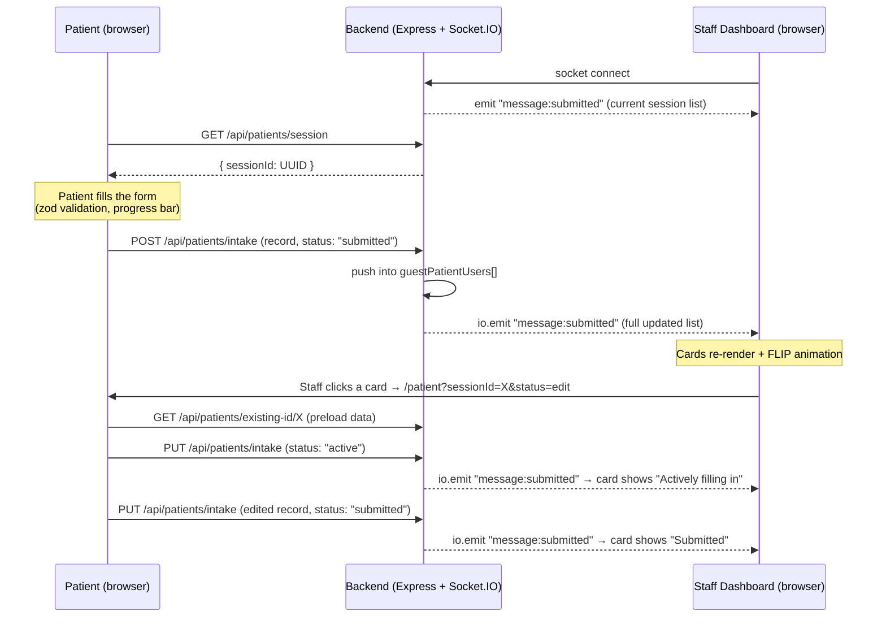

# Development Planning Documentation

This document explains the planning and technical decisions behind the **Patient Intake (Real-time)** project — covering project structure, UI/UX design decisions, component architecture, and the real-time synchronization flow.

---

## 1. Project Structure

### Frontend (`agos-test-fe`)

```
agos-test-fe/
├── src/
│   ├── app/                        # Next.js App Router (pages & layout)
│   │   ├── layout.tsx              # Root layout — wraps the app with QueryProvider
│   │   ├── page.tsx                # Home — role selector (Patient / Staff)
│   │   ├── globals.css             # Design tokens (CSS variables) + Tailwind theme + animations
│   │   ├── patient/page.tsx        # Patient intake form page (wrapped in <Suspense>)
│   │   └── staff/page.tsx          # Staff real-time dashboard page
│   │
│   ├── components/
│   │   ├── index.tsx               # Barrel export for page-level components
│   │   ├── patient/PatientForm.tsx # The full intake form (react-hook-form + zod)
│   │   ├── staff/StaffDashboard.tsx# Live monitor of all patient sessions
│   │   ├── ui/Field.tsx            # Reusable form field wrapper (label / error / optional)
│   │   └── pack/                   # Small presentational building blocks
│   │       ├── LinkCard/           # Navigation card used on the Home page
│   │       ├── PatientCard/        # One patient session card on the dashboard
│   │       ├── StatusPill/         # Colored status badge (active / idle / submitted)
│   │       └── PulseIndicator/     # Animated "live" dot inside the status pill
│   │
│   ├── hook/                       # Custom hooks (logic layer)
│   │   ├── usePatientSession.ts    # Session lifecycle: create / load / draft / submit
│   │   ├── useLiveSessions.ts      # Socket.IO subscription for the staff dashboard
│   │   └── useFlipAnimation.ts     # FLIP animation for card enter/reorder
│   │
│   ├── lib/                        # Framework-agnostic utilities (data layer)
│   │   ├── adapter.ts              # Write API calls (POST / PUT intake)
│   │   ├── session.ts              # Read API calls (session id, existing records)
│   │   ├── schema.ts               # Zod validation schema for the form
│   │   ├── types.ts                # Shared types (PatientRecord, SessionStatus, …)
│   │   └── constants.ts            # API base URL + select options (gender, language, …)
│   │
│   └── providers/
│       └── QueryProvider.tsx       # TanStack Query client provider
│
├── next.config.ts                  # `output: "export"` (static export) + React Compiler
├── firebase.json / .firebaserc     # Firebase Hosting deployment config
└── .env / .env.production          # NEXT_PUBLIC_BASE_API_URL, NEXT_PUBLIC_SOCKET_URL
```

**Why this shape?** The code is split into three clean layers so each concern can change independently:

- **`lib/`** — pure data access & validation. No React imports; can be unit-tested in isolation.
- **`hook/`** — stateful logic that composes `lib/` functions into behaviors a page needs.
- **`components/` + `app/`** — presentation only. Pages stay thin; `pack/` holds tiny reusable pieces, while `patient/` and `staff/` hold the two feature components.

### Backend (`agnos-test-be`)

```
agnos-test-be/
└── src/
    ├── server.js                   # Express app + HTTP server + Socket.IO setup, CORS, port 3006
    ├── routes/patientRoutes.js     # REST routes under /api/patients
    ├── controllers/patientController.js  # Handlers + in-memory "database" (guestPatientUsers[])
    └── sockets/index.js            # Socket.IO connection handler (pushes current state on connect)
```

The backend follows a minimal **routes → controllers** MVC-style split. `io` is injected into every request (`req.io`) via middleware so REST handlers can broadcast socket events after a mutation. Data is kept in an in-memory array to keep the test self-contained (a real deployment would swap this for MongoDB/PostgreSQL without changing the route layer).

---

## 2. Design (UI/UX Decisions per Screen Size)

The UI is built **mobile-first** with Tailwind CSS 4, scaling up through the `sm` (≥640px) and `lg` (≥1024px) breakpoints.

### Layout behavior by screen size

| Area | Mobile (default) | ≥ `sm` (640px) | ≥ `lg` (1024px) |
|---|---|---|---|
| Home role cards | 1 column, stacked | 2 columns side-by-side | — |
| Patient form — Identity | 1 column | 3 columns (first/middle/last name) | — |
| Patient form — other field groups | 1 column | 2 columns | — |
| Staff dashboard cards | 1 column | 2 columns | 3 columns |
| Page padding | `px-4 py-10` | `py-16` (more breathing room) | — |

### Key decisions

- **Content max-widths instead of full-bleed layouts.** The form is capped at `max-w-2xl` and the dashboard at `max-w-6xl`, both centered. Forms stay a comfortable reading/typing width on large monitors, while the dashboard gets more room because scanning many cards benefits from width.
- **Sticky bottom action bar on the form** (`fixed inset-x-0 bottom-0` with `backdrop-blur`). The Submit button and the required-fields progress bar are always visible without scrolling — important on mobile where the form is long. The form body adds `pb-28` so content never hides behind the bar.
- **Progress indicator as instant feedback.** A live counter (`n/9 required fields`) plus an animated progress bar tells the patient how far along they are, computed from `useWatch` on every change.
- **Grouped card sections.** The form is chunked into three cards — *Identity*, *Contact Information*, *Additional Contact* — instead of one long list, reducing cognitive load and making optional fields (marked "optional") visually distinct from required ones.
- **Design tokens over hard-coded colors.** All colors are CSS variables in [globals.css](src/app/globals.css) (`--ink`, `--primary`, `--amber`, `--idle`, …) mapped into Tailwind via `@theme inline`. A calm green primary on an off-white "paper" background fits the healthcare context; status colors are semantic (amber = actively filling in, gray = idle, green = submitted) and used consistently in pills, counters, and indicators.
- **Motion with restraint + accessibility.**
  - Cards animate with the FLIP technique (slide to new position, pop-in on spawn) so the dashboard reorder never "jumps".
  - The live pulse ring / waveform animations communicate activity at a glance.
  - All decorative animations are disabled under `@media (prefers-reduced-motion: reduce)`.
- **Form accessibility.** Every input has a real `<label htmlFor>`, native `autoComplete` hints (`given-name`, `email`, `tel`, …), native input types (`date`, `email`, `tel`), and errors are rendered with `role="alert"`. Validation runs `onBlur` so users aren't shouted at while typing.
- **Truncation guards on cards.** Long values (`email`, `address`, session id) use `truncate` so a single long string can never break the dashboard grid.

---

## 3. Component Architecture

### Pages (thin route shells)

| Component | Purpose |
|---|---|
| [app/page.tsx](src/app/page.tsx) | Home — presents two `LinkCard`s to choose the Patient or Staff view. |
| [app/patient/page.tsx](src/app/patient/page.tsx) | Renders `PatientForm` inside `<Suspense>` (required because the form reads `useSearchParams` in a statically exported app). |
| [app/staff/page.tsx](src/app/staff/page.tsx) | Renders `StaffDashboard`. |

### Feature components

- **[PatientForm](src/components/patient/PatientForm.tsx)** — the core intake form.
  - `react-hook-form` + `zodResolver` with [patientFormSchema](src/lib/schema.ts) for validation (including cross-field rules: emergency contact name ⇄ relationship must come together, DOB can't be in the future).
  - Two modes driven by URL params: **new intake** (no params → generates a fresh session id) and **edit mode** (`?sessionId=…&status=edit` → preloads existing data via `defaultSession` and re-marks the session `active`).
  - Tracks required-field completion with `useWatch` and renders the progress bar.
  - On success, swaps to a confirmation ("You're all set") state.
- **[StaffDashboard](src/components/staff/StaffDashboard.tsx)** — live monitor.
  - Subscribes to the socket via `useLiveSessions`, sorts sessions newest-first, and shows status counters (filling in / inactive / submitted).
  - Wires `useFlipAnimation` refs onto each card so reorders animate.
  - Shows a friendly empty state when no forms are open.

### Building blocks (`components/pack`, `components/ui`)

| Component | Purpose |
|---|---|
| `Field` | Wraps any input with a label, optional marker, and error message — keeps the form markup DRY. Also exports shared `inputClasses`. |
| `PatientCard` | Displays one session (name, all fields, emergency contact, relative timestamps via `date-fns`). Clicking it navigates staff to `/patient?sessionId=…&status=edit`. |
| `StatusPill` | Maps a `SessionStatus` to a colored badge + label. |
| `PulseIndicator` | The animated activity dot inside the pill. |
| `LinkCard` | Navigation card on the Home page. |

### Hooks (logic layer)

| Hook | Responsibility |
|---|---|
| [usePatientSession](src/hook/usePatientSession.ts) | Session lifecycle: `createSession` (GET a UUID), `defaultSession` (load existing record for edit), `publishDraft` (PUT merge-update with a status), `submitForm` (POST final record with `submittedAt`), and `submitted` UI state. Always merges with the existing server record so partial updates never wipe fields. |
| [useLiveSessions](src/hook/useLiveSessions.ts) | Maintains a **module-level singleton** Socket.IO client (survives route changes; only listeners are cleaned up on unmount), listens for `message:submitted`, and exposes `{ pateints, isConnected }`. |
| [useFlipAnimation](src/hook/useFlipAnimation.ts) | Generic FLIP animation: records each card's `DOMRect` before a list change, then animates from old → new position (`useLayoutEffect` + Web Animations API). New cards get a pop-in animation. |

### Data layer (`lib/`)

- `adapter.ts` — write operations (`publish` → POST, `update` → PUT).
- `session.ts` — read operations (`getSessionId`, `getExisting`, `getExistingById`).
- `types.ts` — `PatientRecord` (the single record shape shared FE/BE), `SessionStatus` (`active | idle | submitted`), and `EMPTY_PATIENT_RECORD` used as the merge base.
- `schema.ts` — zod schema, the single source of truth for validation; `PatientFormValues` is inferred from it.
- `constants.ts` — API base URL and all select options.

---

## 4. Real-Time Synchronization Flow

Real-time sync is built on **Socket.IO** with a simple "server broadcasts the full state after every change" model — a good fit for a small dataset because it makes clients trivially consistent (no diffing, no ordering bugs).

### The flow



### Step by step

1. **Initial state on connect.** The moment any staff dashboard connects, the server immediately emits `message:submitted` with the current session list ([sockets/index.js](../agnos-test-be/src/sockets/index.js)) — so a freshly opened dashboard is populated without any extra fetch.
2. **Session creation.** A patient opening `/patient` requests a UUID session id (`GET /session`). This id is the sync key that ties the form to its card on the dashboard.
3. **Mutation → broadcast.** Every REST mutation (`POST /intake`, `PUT /intake`) updates the in-memory store and then broadcasts the **entire updated list** through `req.io.emit('message:submitted', guestPatientUsers)` — the Socket.IO server is injected into Express requests via middleware, so REST and WebSocket share one source of truth.
4. **Client update.** `useLiveSessions` replaces its local state with the broadcast payload. React re-renders the dashboard; `useFlipAnimation` animates any card that moved, and status pills/counters update instantly.
5. **Status lifecycle.** `active` (form being edited) → `submitted` (form sent, `submittedAt` stamped) → `idle` (inactive session). When staff open a submitted record for editing, it is flipped back to `active` so other staff can see someone is working on it.
6. **Merge-safe updates.** Before any publish, the frontend fetches the existing record and merges `EMPTY_PATIENT_RECORD → existing → new values`, preserving `createdAt`/`submittedAt` — so concurrent partial updates never erase previously entered fields.

### Why this design

- **Full-state broadcast** keeps every client consistent with zero client-side merge logic — the right trade-off at this scale (the payload is tiny).
- **Singleton socket** on the frontend avoids duplicate connections/listeners across route navigations.
- **REST for writes + socket for reads** gives standard HTTP semantics (status codes, validation errors) on mutations, while reads stay push-based and instant.
